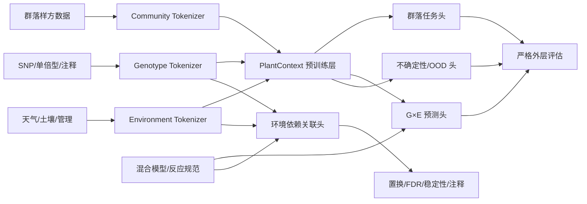

# PlantContext-FM 技术设计文档（TDD）

版本：v1.0  
日期：2026-07-29  
状态：可执行草案  
解释：本文中的 TDD 主要指 Technical Design Document，同时采用 Test-Driven Development 作为实现规范。

## 1. 目标与边界

### 1.1 目标

构建一个支持两类研究任务的统一平台：

1. 植物群落上下文表示与缺失物种/生境预测；
2. 作物基因型–环境–表型预测和环境依赖关联分析。

平台必须：

- 使用结构化而非任意 token 顺序；
- 支持自监督预训练和监督微调；
- 支持未见区域、环境、年份、基因型和 G–E 组合评估；
- 同时提供强统计基线和深度模型；
- 将预测归因与统计关联严格分离；
- 记录数据和模型血缘，能够从冻结配置重建结果。

### 1.2 非目标

第一阶段不做：

- 从零训练超大通用 DNA foundation model；
- 用注意力分数宣称因果基因；
- 全量处理 FIP/TERRA-REF 原始影像；
- 跨作物直接对齐无同源关系的 SNP 列；
- 在随机拆分上宣称未见环境泛化；
- 自动执行湿实验验证。

## 2. 系统概览



核心设计是共享环境表示和评估协议；群落编码器与基因型编码器保持领域特异。

## 3. 推荐代码仓库结构

```text
plant-context-fm/
  README.md
  pyproject.toml
  Makefile
  configs/
    data/
    community/
    gxe/
    association/
    ablation/
  data/
    README.md
    contracts/
    manifests/
    splits/
  src/plant_context/
    data/
      community_adapter.py
      g2f_adapter.py
      cimmyt_adapter.py
      fip1_adapter.py
      qc.py
      contracts.py
    tokenizers/
      community.py
      genotype.py
      environment.py
      masking.py
    models/
      context_encoder.py
      environment_encoder.py
      genotype_encoder.py
      community_model.py
      gxe_model.py
      transfer_diagnosis.py
      association_head.py
      uncertainty.py
    statistics/
      spatial_adjustment.py
      gblup.py
      reaction_norm.py
      factor_analytic.py
      crossfit.py
    association/
      environment_effects.py
      permutation.py
      stability.py
      annotation.py
    evaluation/
      splits.py
      metrics.py
      power_analysis.py
      calibration.py
      error_atlas.py
    tracking/
      manifest.py
      provenance.py
  tests/
    unit/
    contracts/
    leakage/
    integration/
    statistical/
    regression/
  experiments/
    paper1_community_audit/
    paper2_context_pretraining/
    paper3_gxe_prediction/
    paper4_association/
  reports/
  notebooks/
    exploration_only/
```

生产结果不得依赖 notebook 中的隐藏状态。

## 4. 数据契约

### 4.1 phenotype_plot

一行定义：一个 plot/sample 在一个环境中的一个性状观测。

必需字段：

```text
sample_id: string, unique within trait
plot_id: string
genotype_id: string
environment_id: string
year: int
location_id: string
trait: string
phenotype_value: float
unit: string
replicate: nullable string
block: nullable string
row: nullable int
column: nullable int
```

约束：

- `sample_id + trait` 唯一；
- `phenotype_value` 必须有限；
- 单位必须来自受控词表；
- 调整值和原始值必须使用不同字段；
- 每次排除记录必须带 `qc_flag` 和原因。

### 4.2 genotype_marker

支持长表或冻结宽表。

```text
genotype_id
marker_id
chromosome
position
reference_build
allele_dosage
imputation_quality
ld_block_id
gene_id
parent1
parent2
tester
```

约束：

- token 化前必须按 chromosome、position 排序；
- 窗口不得跨染色体；
- 参考基因组版本不可为空；
- SNP 选择只在训练折拟合；
- 用于关联的标记列表与用于预测降维的列表分别保存。

### 4.3 environment_daily

```text
environment_id
date
days_after_planting
thermal_time
growth_stage
tmin
tmax
precipitation
solar_radiation
relative_humidity
vpd
wind
soil_moisture
et0
water_deficit
source
missing_flag
```

约束：

- 日期在种植—收获窗口内；
- 不允许用测试环境的表型估计环境特征；
- 缺失插补器只在训练环境拟合；
- 原始天气、派生胁迫指标和作物模型输出分层存储。

### 4.4 community_plot

```text
plot_id
survey_date
latitude
longitude
species_id
accepted_taxon_id
abundance
abundance_scale
habitat_label
dataset_id
```

约束：

- 物种名必须映射到冻结 taxonomy；
- 原始丰度和统一量表同时保存；
- habitat_label 标记其来源是专家、规则系统还是模型；
- 相同地点的重复调查必须成组划分，避免空间/时间泄漏。

### 4.5 split_table

```text
sample_id
outer_split_type
outer_fold
role
seed
group_key
split_version
```

允许的 `role`：train、validation、test。

## 5. Tokenizer 设计

### 5.1 CommunityTokenizer

输入：

- 样方物种、丰度、分类层级；
- 可选环境 token。

token 元数据：

- species_id；
- family/genus；
- abundance_bin 或 rank；
- native/introduced 状态（数据允许时）；
- taxonomy 版本。

遮盖策略：

- 随机物种 mask；
- 整属/整科 mask；
- 稀有物种增强 mask；
- abundance-contiguous mask；
- 环境条件化 mask。

### 5.2 GenotypeTokenizer

默认模式：

1. 按染色体和物理位置排序；
2. 在训练折构建 LD block，但 block 边界（如固定物理窗口或基因窗口）应在所有 fold 间保持一致，仅 block 内的 LD 统计量可在训练折内重新估计；
3. 每个 block 形成 token；
4. 过大 block 内使用固定数量 marker、局部 PCA 或轻量编码器；
5. 附加 chromosome、position、block size、MAF 和 gene metadata。

不得采用“按方差大小排序后连续分块”作为生物序列。

备选粒度：

- 固定物理窗口；
- 基因窗口；
- 单倍型块；
- 共线性基因 token，用于跨作物研究。

### 5.3 EnvironmentTokenizer

默认以物候阶段为单位：

- pre-planting；
- emergence；
- vegetative；
- flowering；
- grain filling；
- maturity。

每个阶段生成：

- 温度均值/极值和热小时；
- GDD；
- 降水、ET0 和水分亏缺；
- VPD；
- 辐射；
- 土壤水分；
- 管理事件；
- 缺失比例和数据源。

如果物候日期缺失：

1. 使用 GDD 规则估计；
2. 将估计标志作为输入；
3. 对估计误差做敏感性分析；
4. **数据审计阶段必须报告：物候日期缺失/需估计的环境比例、估计方法、估计误差的分布，以及大量估计是否导致阶段边界系统偏移。**

## 6. 模型设计

### 6.1 Shared Environment Encoder

输入：`[batch, stage, feature]`  
输出：阶段 token 和 pooled environment embedding。

候选结构按优先顺序：

1. 两层 TCN/小型 Transformer；
2. stage-aware attention；
3. state-space model，仅在长序列证明有必要时使用。

要求：

- 参数量受控；
- 支持缺失掩码；
- 返回阶段表示，便于关联；
- 可在群落与 G×E 之间迁移；
- 能冻结、微调或从零训练。

**跨域迁移失败诊断协议。** 共享环境编码器在群落数据上预训练后，迁移到 G×E 任务时必须按以下协议诊断：

1. **基线比较**：冻结编码器 + 任务头 vs. 同架构随机初始化；vs. 仅在 G×E 数据上训练的编码器。
2. **微调层级消融**：冻结所有层、只微调输出头、逐层解冻、全部微调，观察收益变化曲线。
3. **域差异量化**：比较自然群落与农田环境在气候/物候分布（如温度、降水、VPD、GDD 的分布距离）、土壤变量和管理强度上的差异；使用 Wasserstein 距离或最大均值差异（MMD）等指标。
4. **失败模式判定**：
   - 若冻结编码器不优于随机初始化且域差异大 → 记录为“域差距失败”；
   - 若冻结不优但全微调可消除差距 → 记录为“容量/优化失败”；
   - 若冻结即优 → 记录为“成功迁移”。
5. **报告**：三种模式均需在论文/审计报告中明确记录，失败时分析导致不可迁移的具体环境变量。

### 6.2 Community Context Model

输入：物种 token + 环境 token。

预训练目标：

- masked species prediction；
- abundance/rank reconstruction；
- plot–environment contrastive alignment；
- taxonomy-aware auxiliary loss。

下游任务：

- 缺失物种；
- 生境分类；
- 群落完整性/OOD；
- 环境梯度预测。

### 6.3 Statistical G×E Backbone

基础模型：

\[
y = X\beta + Z_g u_g + Z_e u_e + Z_{ge}u_{ge} + \epsilon
\]

扩展：

- reaction norm；
- marker × environmental covariate kernel；
- factor-analytic/MegaLMM；
- 空间 row/column/block 效应；
- tester/parent 和 pedigree/genomic relationship。

输出：

- cross-fitted 主效应预测；
- cross-fitted 残差；
- 方差分量；
- 反应规范参数。

外层测试样本不得参与方差分量、环境轴或残差目标的估计。

### 6.4 Nonlinear Residual G×E Model

输入：

- genotype block tokens；
- environment stage tokens；
- static soil/management；
- 可选统计模型预测。

融合候选：

1. 低秩双线性交互；
2. FiLM；
3. cross-attention。

选择原则：从最简单模型开始，只有配对消融证明增益后才升级。

输出：

- 表型均值或 G×E 残差；
- aleatoric variance；
- ensemble/MC dropout epistemic uncertainty。

### 6.5 Association Head

目的：估计而不是仅归因环境依赖效应。

\[
\beta_j(e)=\beta_{j0}+\sum_k\beta_{jk}z_{ek}
\]

实现路线：

- 基础：反应规范系数 GWAS；
- 扩展：稀疏/层级 marker × environment 效应；
- 深度模型仅用于候选生成或学习环境轴；
- 显著性来自置换/重采样/明确统计模型。

**高维控制与多重检验。** marker × environment 模型面临高维性和强 LD 结构：

- 使用稀疏惩罚（LASSO、弹性网络、群组 Lasso）或层级贝叶斯模型控制高维性；
- 置换检验必须保留 LD 块和环境组结构，避免破坏连锁不平衡或环境相关性；
- 明确报告置换次数、经验零分布构建方式、FDR 目标水平（如 q ≤ 0.10）和 genomic inflation factor；
- bootstrap 稳定性评估使用相同的 LD/环境保留策略；
- 候选位点需经留出年份或独立数据集重复，才能进入基因/QTL 注释。

输出：

- marker/block effect；
- environment-specific effect curve；
- empirical p-value；
- q-value/FDR；
- bootstrap selection frequency；
- candidate gene/QTL annotation。

## 7. 自监督预训练

### 7.1 基因型任务

首选：

- 预测遮盖 block 内的等位基因剂量分布；
- 预测单倍型类别；
- 染色体连续 block mask；
- 低频变异加权损失。

不允许：

- 目标和预测共享可自由塌缩的投影而无停止梯度；
- 把无坐标对齐的跨物种 SNP 列当相同 token。

如果预测隐藏表示：

- 使用 EMA teacher；
- teacher 分支停止梯度；
- 监测 embedding 每维标准差、有效秩和协方差；
- 设置 collapse 自动失败门。

### 7.2 环境任务

- 连续阶段遮盖；
- 下一阶段预测；
- 极端事件检测；
- 同环境不同数据源的一致性学习；
- 环境相似性对比学习。

### 7.3 群落任务

- 结构化物种遮盖；
- taxonomy consistency；
- plot–environment matching；
- 稀有物种和迁入物种专项任务。

## 8. 数据划分与防泄漏

### 8.1 G×E 外层划分

- `leave_genotype_out`：测试 genotype_id 不出现在训练；
- `leave_environment_out`：测试 environment_id 不出现在训练；
- `forward_year`：测试年份严格晚于训练年份；
- `leave_ge_out`：测试 G–E 组合未见，但 G 和 E 可分别出现；
- 可选 `leave_location_out`：测试地点完全未见。

### 8.2 群落外层划分

- spatial block；
- temporal holdout；
- dataset/source holdout；
- rare-species holdout；
- habitat transfer。

### 8.3 训练折内拟合清单

以下对象必须只用外层训练数据拟合：

- 插补器；
- 标准化器；
- SNP 选择；
- LD block 参数；
- PCA；
- taxonomy/OOV 词表的可学习部分；
- 环境聚类和环境轴；
- 混合模型方差分量；
- 残差目标；
- 校准器；
- 超参数选择。

## 9. 评价指标

### 9.1 预测

- RMSE、MAE；
- Pearson、Spearman；
- environment-centered correlation；
- genotype ranking correlation；
- Top-5/10/20% selection gain；
- worst-environment RMSE；
- 各环境和各年份的 paired error。

### 9.2 不确定性

- prediction interval coverage；
- interval width；
- Gaussian NLL/CRPS；
- calibration slope/intercept；
- uncertainty–error correlation；
- OOD AUROC。

### 9.3 关联

- simulation power；
- empirical type-I error；
- empirical FDR；
- genomic inflation/calibration；
- bootstrap stability；
- leave-year replication rate；
- gene/QTL enrichment。

### 9.4 群落

- masked species top-k accuracy/recall；
- macro-F1，防止常见物种主导；
- rare-species recall；
- habitat macro-F1；
- spatial/temporal OOD drop；
- calibration。

## 10. Test-Driven Development 规范

每个实现项遵循：

1. 先写失败测试；
2. 写最小实现；
3. 通过单元测试；
4. 运行合成数据端到端测试；
5. 才允许进入真实数据实验。

### 10.1 单元测试

#### GenotypeTokenizer

- 输入乱序 marker 后输出严格按 chromosome、position 排序；
- token 不跨染色体；
- LD block ID 稳定；
- 未见 marker 使用显式 OOV/missing；
- 训练外 SNP 统计不影响训练 tokenizer。

#### EnvironmentTokenizer

- DAP 和 GDD 单调；
- 阶段边界确定；
- 连续阶段 mask 不泄露目标；
- 缺失标志和插补值同步；
- 使用测试年份极值拟合 scaler 时测试必须失败。

#### CommunityTokenizer

- taxonomy 映射可重现；
- 同义词映射到 accepted_taxon_id；
- abundance rank 对确定输入稳定；
- habitat 伪标签来源不会被误标成专家标签。

### 10.2 数据契约测试

- 主键唯一；
- 外键完整；
- 类型和单位合法；
- 坐标、日期、等位基因剂量范围合法；
- 未匹配率超过阈值时流水线失败；
- 数据版本和哈希存在。

### 10.3 泄漏测试

- leave-genotype-out 中 train/test genotype 交集为 0；
- leave-environment-out 中 environment 交集为 0；
- forward-year 中 `max(train_year) < min(test_year)`；
- group split 后重复地点或小区不跨折；
- 预处理对象记录的 fit IDs 是训练 ID 子集；
- 残差模型不读取外层测试表型。

### 10.4 统计测试

使用可控模拟数据：

- 纯主效应数据中深度 G×E 不应产生系统增益；
- 已知线性 G×E 时 reaction norm 应恢复效应方向；
- 已知非线性 G×E 时残差模型应优于纯线性模型；
- 零关联模拟中经验 FDR 达标；
- 植入 QTL×E 时能恢复设定位置和效应曲线。

### 10.5 模型行为测试

- 打乱表型后性能回到随机/均值水平；
- 移除基因型后未见 genotype 性能合理下降；
- 移除环境后未见 environment 性能合理下降；
- 染色体内/间打乱与 LD-block 打乱分别测试；
- 天气逐日打乱、阶段打乱和环境整体打乱分别测试；
- 相同 checkpoint 和输入产生相同推理结果；
- embedding 有效秩和方差不低于 collapse 阈值。

### 10.6 集成与回归测试

最小合成数据：

- 40 genotype；
- 8 environment；
- 3 year；
- 500 marker；
- 120 weather days；
- 2 traits；
- 带已知主效应和一个非线性 QTL×heat interaction。

CI 中必须在 CPU 上完成：

- 数据适配；
- 四种划分；
- 训练一个小模型；
- 生成预测和关联结果；
- 验证预期 QTL；
- 生成 manifest。

真实数据 nightly 测试：

- 固定小样本；
- 固定 seed；
- 指标变化超过容忍阈值时报警。

## 11. 验收标准

### 11.1 数据层 Definition of Done

- 数据契约测试全部通过；
- 数据版本和哈希记录完整；
- 关键连接率达到数据审计预设标准；
- 所有未匹配记录有原因；
- 四种外层划分无泄漏。

### 11.2 基线层 Definition of Done

- GBLUP/Ridge、reaction norm、LightGBM 可在同一 split 运行；
- 指标、样本和预处理完全一致；
- 三个随机种子或确定性拟合；
- 可生成逐环境误差表。

### 11.3 新模型 Definition of Done

- 至少三个种子；**若使用 n=3–5 种子，必须预先报告最小可检测效应（MDE），确保其低于预期模型差距；否则增加种子数或采用确定性交叉验证；**
- 配对 bootstrap CI；
- 与最佳调参强基线比较；
- 消融覆盖 genotype、environment、fusion、pretraining；
- 参数量和训练预算报告；
- OOD 与校准结果完整。

### 11.4 关联层 Definition of Done

- 模拟 type-I error/FDR 校准；
- permutation 方案保持 LD/环境组结构；
- 输出 q-value 和稳定性；
- 候选跨年份或外部验证；
- 归因和关联结果使用不同名称、图表和结论等级。

## 12. Go/No-Go 门槛

### Gate A：数据可行性

通过条件：

- G2F 表型、基因型和环境能稳定连接；
- 至少三个年份和足够环境可用于 forward-year；
- 群落数据可合法用于训练。

不通过：缩小问题或更换数据，不进入模型扩展。

### Gate B：基线可信度

通过条件：

- 公开统计基线趋势可复现；
- 没有明显目标/环境泄漏；
- 指标在重复运行中稳定。

不通过：暂停深度模型，优先解决数据定义。

### Gate C：结构化 token 价值

通过条件：

- 正确染色体/LD 顺序相对严格打乱对照，在多个 split/seed 上有稳定差异；
  - **量化标准**：在至少两个 OOD 划分上，正确顺序的 RMSE 比严格打乱对照低，且配对 bootstrap 95% CI 不跨 0，或效应量超过预先计算的 MDE；
- 或失败分析能明确说明顺序不重要的条件（如报告在何种遗传结构或环境分布下顺序无增益）。

不通过：在论文中仅将“结构化 token 带来 OOD 增益”作为假设，不做过度主张。

### Gate D：预训练价值

通过条件：

- 在低标签或 OOD 条件下一致优于随机初始化；
  - **量化标准**：在 10%–50% 标签比例或 leave-environment/forward-year 划分上，预训练模型的 RMSE 低于随机初始化，且配对 bootstrap 95% CI 不跨 0，或效应量超过 MDE；
- 表示无塌缩；
  - **量化标准**：embedding 有效秩 ≥ 0.5 × 维度，每维标准差 ≥ 0.1（经适当缩放后），协方差矩阵非退化；
- 预训练收益不是仅由更多训练轮数造成；
  - **量化标准**：与“随机初始化 + 同等总训练步数”对照比较，预训练仍保持优势。

不通过：保留监督模型，将预训练作为负结果/边界研究。

### Gate E：关联可信度

通过条件：

- 模拟 FDR 达标；
- 候选效应跨 bootstrap 稳定；
- 至少一部分在留出年份或外部数据重复。

不通过：只能表述为模型候选区域，不做关联或基因发现宣称。

## 13. 实验追踪与可复现性

每次运行保存：

```text
run_id
git_commit
config_hash
data_manifest_hash
split_version
seed
hardware
start/end time
metrics
predictions path
checkpoint path
environment/package lock
```

规则：

- 论文表格只能从登记过的 run 生成；
- 手工修改 CSV 后不得进入论文；
- 图表脚本读取冻结结果；
- 失败运行也保留状态和错误原因；
- 模型选择只看 validation，不看 test。

## 14. 风险与缓解

| 风险 | 影响 | 缓解 |
|---|---|---|
| 群落与育种两部分被认为割裂 | 博士主线不成立 | 共享环境编码器、共享评估协议和桥接实验 |
| G2F 数据不平衡和字段异构 | 模型学到年份/地点偏差 | 数据审计、层级效应、group split、逐年敏感性分析 |
| 深度模型不胜强基线 | 方法论文困难 | 预注册失败分析和简单性论文路线 |
| 预训练塌缩 | 虚假低损失 | EMA teacher、表示监测、低样本外部任务 |
| SNP token 顺序错误 | “语法”结论失真 | marker map、染色体边界测试、LD-aware 对照 |
| 归因被误作关联 | 生物结论不可信 | 独立 association head、FDR 和重复验证 |
| 外部数据定义不同 | 难以直接迁移 | 特征交集、环境编码迁移、数据集特异输出头 |
| 计算成本失控 | 延误博士进度 | 12 周 MVP 和阶段性算力 Gate；为每个阶段设置 GPU/CPU 小时预算上限，超支时强制进入失败分析或简化路线 |

## 15. 第一版实现顺序

1. 数据契约与合成数据；
2. G2F adapter；
3. 四种 split 和泄漏测试；
4. Ridge/GBLUP 与 reaction norm；
5. 物候 EnvironmentTokenizer；
6. 坐标正确的 GenotypeTokenizer；
7. 简单低秩 G×E 模型；
8. SRG-GxE 对照复现；
9. 结构化预训练；
10. association head；
11. community adapter/model；
12. 共享环境编码与桥接实验。

先完成 1–8 才进入大规模预训练。**每个阶段设置 GPU/CPU 小时预算；若连续两周超支且无明确正向信号，则进入对应 Gate 的失败分析分支。**

